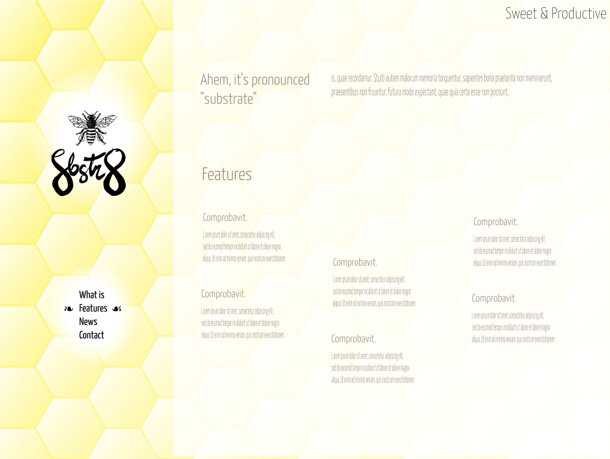

# Plan 2023-07-08

- The end state of the site should look basically like the sketch: 

- Ingredients:
  - Font stack:
    - Headings: Yanone Kaffeesatz font, normal, light & extralight.
    - Body: Roboto Condensed Light
    - Monospace: Roboto Mono Thin
  - [honeycomb background](../assets/bg-hex.svg)
  - [glow background](../assets/bg-glow.svg) (used x2)
  - Floral heart and floral-heart reversed unicode ❧  ☙
  - brown/amber from tailwind near #917c6f . Maybe a bit darker tho
- Tradeoffs & pain points:
  - Lots of transparency means scrolling perf will be bad on older devices (anything without GPU accel)
  - Need some code to adjust hash part of URL while scrolling in order for LHS menu to keep up

